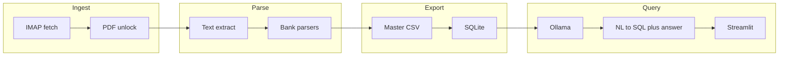

# CardQL architecture

## Pipeline (high level)

## Bare `cardql` (no subcommand)

1. **Init** — `ensure_local_dirs`, `write_config_templates` (create-if-missing only).
2. **Fetch** — IMAP when `card_rules.json` has email rules (unless `--no-fetch`).
3. **Parse / export** — Normalize PDFs to JSON under `data/normalized/`, merge to **`data/exports/master.csv`**, build **`transactions.sqlite`**, optionally open CSV (unless `--no-open`).
4. **Ollama** — Ensure API + pull default model (unless `--skip-ollama`).
5. **UI** — Launch Streamlit (unless `--no-ui`).

## Data locations

- **`.local/config/`** — `secrets.json`, `card_rules.json`, optional `tags.json`, `app.json` (gitignored).
- **`data/raw-pdfs/<bank>/<card>/`** — PDFs.
- **`data/normalized/`** — Per-statement JSON.
- **`data/exports/master.csv`**, **`transactions.sqlite`** — Query surfaces for NL and `cardql sql`.

## LLM and privacy

Natural-language Q&A runs **only against local SQLite** via **Ollama**; prompts include schema and sample rows. Arithmetic and aggregates are enforced in **SQL**, not trusted from free-form model output. No third-party cloud API is required for parsing or querying.

## Package layout (source)

| Area | Path | Role |
|------|------|------|
| Ingest | `cardql/ingest/` | IMAP fetch, PDF unlock, text extraction |
| Parse | `cardql/parsers/` | Bank parsers + normalized schema |
| Export | `cardql/export/` | `master.csv` → SQLite |
| Query | `cardql/query/` | NL→SQL pipeline, Ollama helpers (`ollama_setup.py`) |
| UI | `cardql/ui/` | Streamlit |
| CLI | `cardql/cli/` | Typer entrypoint |

Top-level **`paths.py`** and **`config.py`** wire repo layout and settings.
